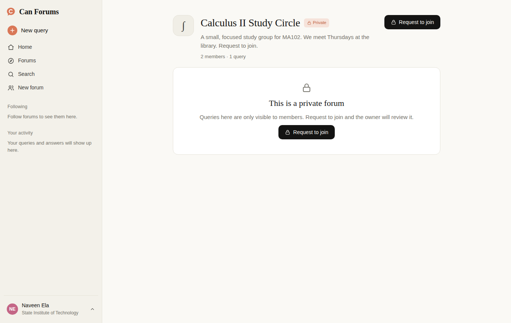

# Can Forums

> "Can anyone help with…?" Yes. Your campus can.

Can Forums is a campus Q&A and community app for college students. Students **raise queries** that peers
answer. They can also **create public or private forums** for courses, clubs, hostels and study circles.
Others can follow a public forum or request to join a private one.

The UI follows a calm, warm, Claude-inspired style: ivory and charcoal surfaces, a clay accent, serif
headings and answers, a large rounded composer, a collapsible sidebar and light/dark themes.

The full product ideation (personas, feature set, permissions, roadmap, metrics) is in
[`docs/PRODUCT.md`](docs/PRODUCT.md).

## Screenshots

| Home (ask) | Thread (dark) |
| --- | --- |
|  |  |
| **Forums** | **Private forum** |
|  |  |

## Features

- **Ask**: a greeting and composer on the home page. The first line becomes the title. You can pick a forum, add tags and post anonymously.
- **Feed**: For you · Latest · Unanswered · Solved · Saved.
- **Threads**: the question appears as a bubble and answers read like a conversation. You can upvote ("Helpful"), accept an answer, save or delete a query, and use code blocks.
- **Forums**: Discover, Following and Created-by-you tabs, plus search and a public/private filter.
- **Public forums**: follow instantly.
- **Private forums**: queries stay locked until you **request to join** and the owner **approves** you. Owners get a join-requests panel, can remove members, and can switch visibility.
- **Search** across queries, answers, forums and `#tags`. Results only include content you are allowed to see.
- **Profile**: helpfulness points (+10 per accepted answer, +2 per helpful vote), stats, and editable details.
- Responsive mobile drawer, offline banner, and PWA support (from the boilerplate).

## Tech

React 18 · Redux (thunk) · React Router 6 · Create React App.

- `src/reducers/boardReducer.js`: users, forums and queries (persisted to `localStorage`, seeded from `src/data/seed.js`)
- `src/utils/selectors.js`: access rules (`canView`, `canPost`) and feed filters
- `src/layouts/*`: pages (login, home, query, forums, forum, search, profile)
- `src/components/*`: sidebar, composer, cards, create-forum modal, icons

Authentication is mocked: sign in with any name and email. A real backend with college-email
verification is the first roadmap item.

## Scripts

```bash
npm install
npm start          # dev server on http://localhost:3000
npm test           # unit + integration tests
npm run build      # production build
```

To reset the demo data, clear the site's local storage (key `canforums:board:v1`).
