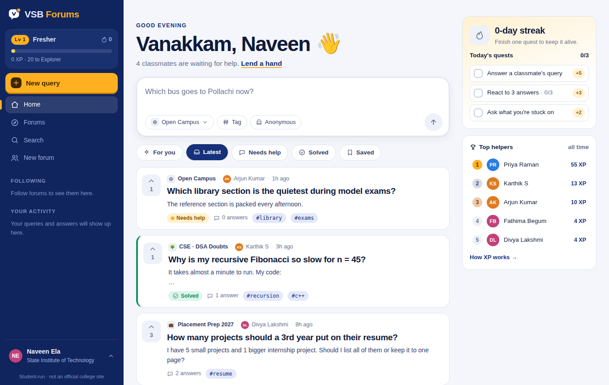
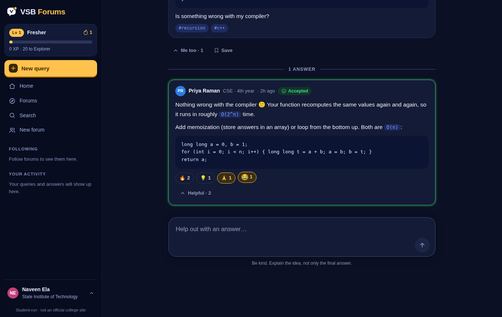
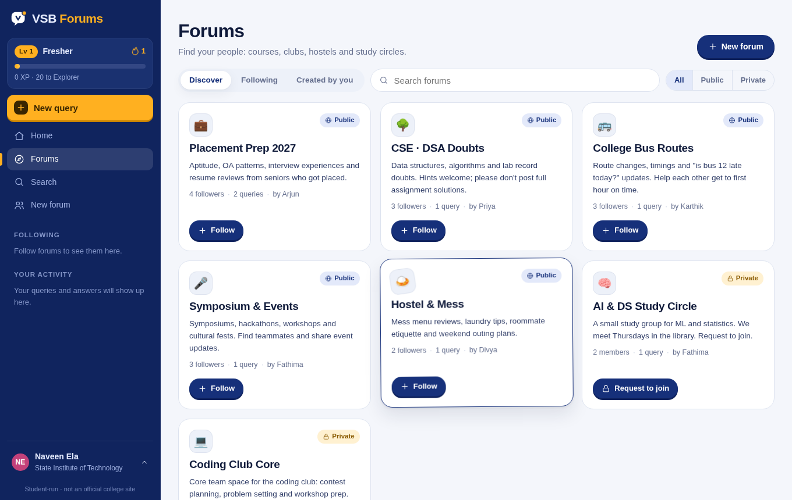
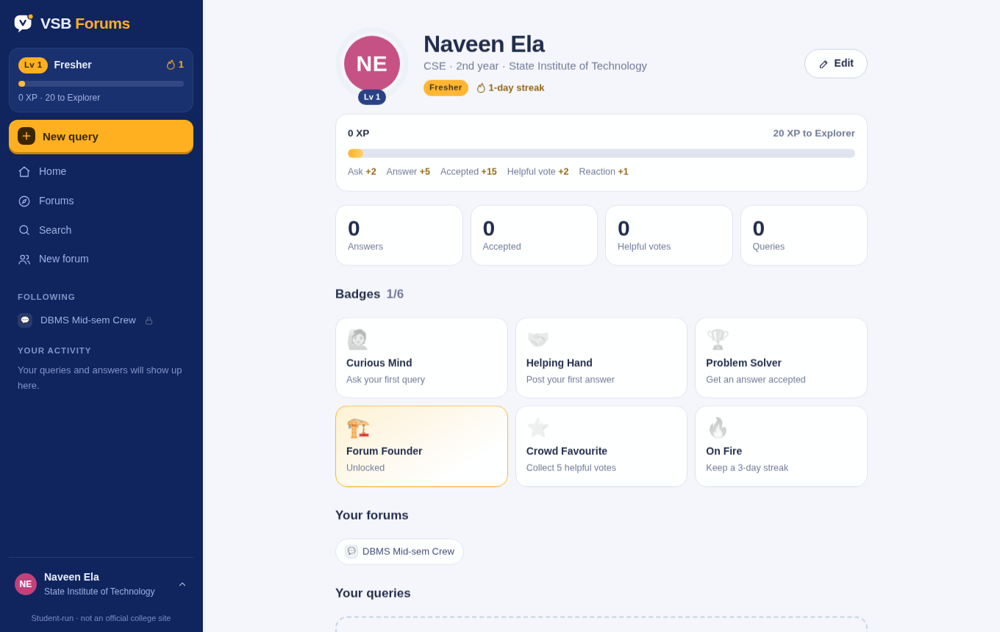

# VSB Forums

> Stuck on something? **Ask VSB.**

VSB Forums is a student-run Q&A hangout for VSB College of Engineering Technical Campus. Students
**raise queries** that batchmates and seniors answer. They can also **create public or private forums**
for their department, club, bus route or study circle, and others can follow a forum or request to join.
XP, levels, daily streaks, quests and badges keep people coming back to help.

> This is an unofficial student project and is not affiliated with or endorsed by the college.

The full product ideation (personas, feature set, engagement loop, permissions, roadmap, metrics) is in
[`docs/PRODUCT.md`](docs/PRODUCT.md).

## Screenshots

| Home | Thread (dark) |
| --- | --- |
|  |  |
| **Forums** | **Profile, XP & badges** |
|  |  |

## Features

- **Ask**: a "Vanakkam" greeting and a composer whose prompts rotate ("Which bus goes to Pollachi now?"). The first line becomes the title. You can pick a forum, add tags or post anonymously.
- **Feed**: For you · Latest · Needs help · Solved · Saved. New students who follow nothing see the whole campus.
- **Threads**: answers with emoji reactions (🔥 💡 🙏 😂) and "Helpful" votes, one accepted answer (with confetti), saves, and code blocks.
- **Forums**:
  - Public forums can be followed instantly.
  - Private forums stay locked until the owner **approves** a join request. Owners get a requests panel, can remove members and can switch visibility.
- **Engagement**:
  - XP, and levels from Fresher to Legend.
  - A daily streak and three daily quests.
  - A Top helpers leaderboard.
  - Six badges, with unlock toasts and confetti.
- **Micro-interactions**:
  - Upvote pops with a "+1".
  - Springy cards, chips and buttons.
  - A send button that flies off when you post.
  - A flickering streak flame and a shimmering XP bar.
  - A moving ticker of real questions on the sign-in page.
  - All motion respects `prefers-reduced-motion`.
- **Search**, profile, light/dark/system theme, a responsive mobile drawer, and an offline banner.

## Theming

All colors are CSS tokens at the top of `src/assets/css/main.css`. The brand colors (`--brand*` navy and
`--amber*`) are **provisional**: the college website couldn't be reached from the build environment,
so swap in the official hex values there to retheme the whole app.

## Tech

React 18 · Redux (thunk) · React Router 6 · Create React App.

- `src/reducers/boardReducer.js`: users, forums, queries and the activity log (persisted to `localStorage`, seeded from `src/data/seed.js`)
- `src/utils/selectors.js`: access rules, feeds, and the XP/level/streak/quest/badge logic
- `src/components/Fx.js`: toasts, confetti, confirm dialog, badge watcher, "+1" bursts
- `src/layouts/*`: pages (login, home, query, forums, forum, search, profile)

Sign-in is mocked. You can use any name and email, or **Try the demo as a guest**.

## Scripts

```bash
npm install
npm start               # dev server on http://localhost:3000
npm test                # tests
npm run build           # production build
npm run build:preview   # single-file preview at preview/vsb-forums.html
```

To reset the demo data, clear the site's local storage (key `vsbforums:board:v1`).
